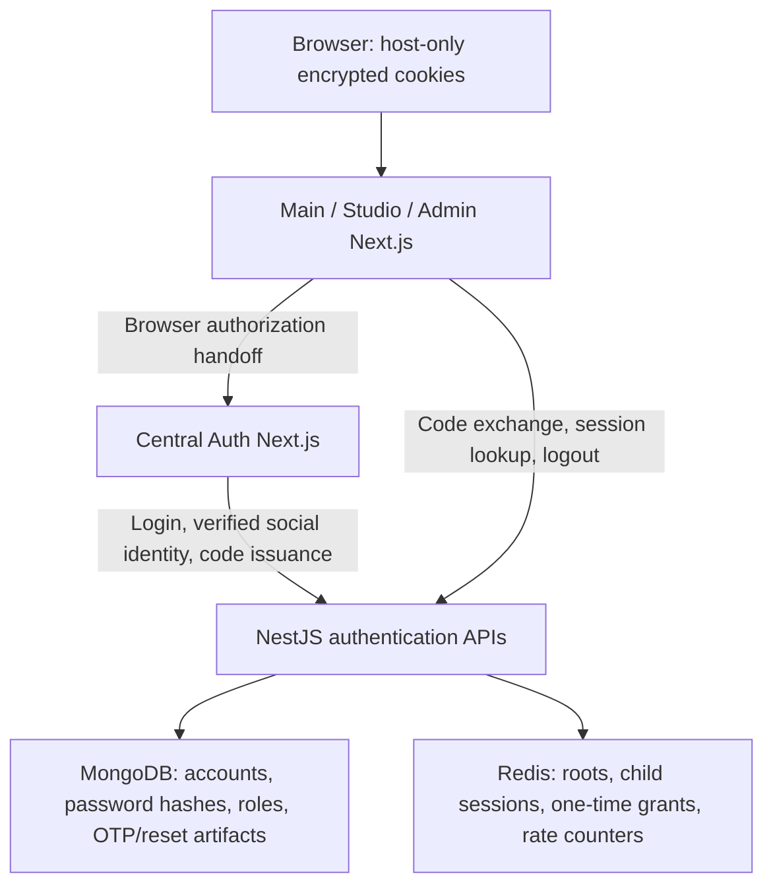
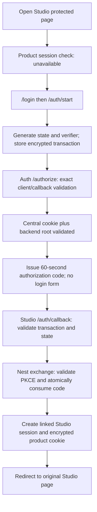
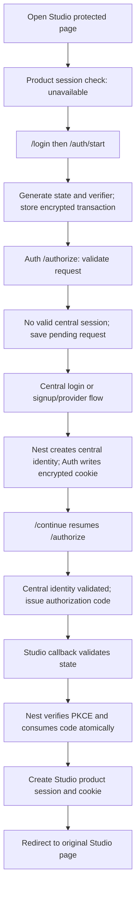

# Blynta centralized authentication: implementation audit

> Historical audit: Admin and logout policy have since changed. See [current authentication boundaries](auth-boundaries.md).

Audit date: 3 October 2026. Studio, Main and Admin were inspected. The investigation used source inspection and isolated, in-memory checks; it did not change authentication code, restart deployed services, or modify real accounts. Subsequently, the user's separate request authorized adding commented production references to environment files. Their active settings were preserved.

**Direct answer:** the long authorization URL is correct when a product needs to establish its session. Restarting only Studio does not inherently invalidate that session. With a decryptable cookie, a valid Redis session/root, and successful backend validation, opening Studio `/` should remain in Studio. The current code does clear a product cookie when any backend session validation fails, including a temporary outage. This behavior affects Main and Admin too. The specific historical trigger for the reported visit cannot be established from the available evidence.

## 1. Why Studio redirects to `/authorize`

The actual protected navigation is:

1. [Studio proxy](D:/web_dev/Blynta/apps/studio/proxy.ts:1) wraps requests in `auth()`. Auth.js reads the product cookie and runs the shared session callback, including a backend session lookup.
2. If `request.auth?.user` is absent, the proxy redirects to `/login?callbackUrl=<original path and query>`.
3. [Studio login](<D:/web_dev/Blynta/apps/studio/app/(auth)/login/page.tsx:1>), with `CENTRAL_AUTH_ENABLED=true`, redirects to `/auth/start?returnTo=...`.
4. [Studio start route](D:/web_dev/Blynta/apps/studio/app/auth/start/route.ts:1) calls shared `startAuthorization("blynta-studio", "STUDIO_APP_URL", "/dashboard")`.
5. [Shared startAuthorization](D:/web_dev/Blynta/packages/auth/src/server.ts:91) generates state/verifier, encrypts the transaction into a product cookie and redirects to central `/authorize`.

Studio `/` itself redirects to `/dashboard`; it does not unconditionally redirect to Auth. Studio's protected layout performs another `auth()` check. Directly opening `/login` or `/auth/start` does unconditionally initiate a handoff, even with an existing product session, but the user confirmed that their first URL was `/`.

## 2. The long URL and its parameters

| Parameter                    | Generated/configured by                                          | Storage and validation                                                                                                                |
| ---------------------------- | ---------------------------------------------------------------- | ------------------------------------------------------------------------------------------------------------------------------------- |
| `response_type=code`         | Shared start helper                                              | Backend requires literal `code`; this constant has no lifetime or single-use meaning                                                  |
| `client_id=blynta-studio`    | Studio start route                                               | Backend checks its explicit `SSO_CLIENTS` registry; recorded in transaction and grant                                                 |
| `redirect_uri`               | Helper constructs `/auth/callback` from `STUDIO_APP_URL`         | Backend requires exact registry equality; product checks its configured callback again; grant exchange requires the same URI          |
| `state`                      | Studio server generates 32 random bytes, base64url encoded       | Encrypted product transaction, optional central pending-request cookie, then Redis grant; callback compares it with `timingSafeEqual` |
| `code_challenge`             | Studio hashes its verifier with SHA-256 and base64url encodes it | Authorization URL, optional central pending cookie, Redis grant; backend compares it with the hash of the submitted verifier          |
| `code_challenge_method=S256` | Shared helper                                                    | Backend accepts only S256; constant, not an expiring credential                                                                       |

Product transactions and central pending requests last ten minutes. Issued codes last 60 seconds and are single-use. Client IDs, callbacks, state and challenges are not reusable login credentials. The verifier, passwords, bridge secret, opaque session credentials and API access tokens do not travel in these SSO redirect URLs. The callback contains only `code` and `state`. Password-recovery URLs separately carry their existing single-use reset token; that is not an SSO access or refresh token.

## 3. Restart behavior: what was actually found

The user restarted only the Studio frontend, leaving Auth, Nest and Redis running, and opened `http://localhost:3002/`. Therefore a backend restart and a direct visit to `/login` do not explain the reported incident.

There is no production SSO session map inside the Studio process. Session state resides in browser cookies and Redis. `pnpm dev` does not run the secret-setup script. Current local files have distinct, present `AUTH_SECRET` values for all four apps, with no conflicting `NEXTAUTH_SECRET` aliases. These file checks do not reveal what key an earlier running server had loaded.

The concrete failure path is [shared sessionCallbacks](D:/web_dev/Blynta/packages/auth/src/server.ts:231):

```text
Read/decrypt product cookie
  → POST backend /auth/sso/session
  → any exception: return null
  → Auth.js cleans the session cookie
  → proxy sees no user
  → /login → /auth/start → central /authorize
```

`callIdentity` distinguishes configuration errors, 429 responses, service outages and authentication failures, but this callback catches them all and returns `null`. Its fetch timeout is 15 seconds. The installed Auth.js session action clears cookies on a null callback result, and its Next.js wrapper forwards those cookie deletions to the browser.

In isolated fresh Node processes using the actual shared product configuration and installed Auth.js, with synthetic cookies and a mocked backend:

| Product | First fresh process | Second fresh process, same cookie/key | Backend validation failure   |
| ------- | ------------------- | ------------------------------------- | ---------------------------- |
| Main    | Authenticated       | Authenticated                         | Null session; cookie cleared |
| Studio  | Authenticated       | Authenticated                         | Null session; cookie cleared |
| Admin   | Authenticated       | Authenticated                         | Null session; cookie cleared |

This tests process-independent session decoding and the actual cookie-clearing behavior; it is not a reproduction of the user's browser incident or a real Next development-server restart. Available development logs contain no matching diagnostic that identifies that incident. The catch above also suppresses the failure reason, so absence of an error log does not rule it out.

Earlier local setup intentionally replaced duplicated product auth keys. A cookie issued before such a replacement fails when Studio loads its new key after restarting. This is a possible one-time explanation, not a proven explanation for this user's cookie. Other possible triggers are a missing/expired cookie, a hostname or development/production cookie-name change, an expired/revoked Redis record, or an unsuccessful backend lookup despite the backend remaining running.

| Requested classification             | Conclusion                                                                                                                                                          |
| ------------------------------------ | ------------------------------------------------------------------------------------------------------------------------------------------------------------------- |
| A. Expected development behavior     | A frontend restart alone should not require SSO                                                                                                                     |
| B. Intentional architecture          | SSO without a login form is intentional when the local product session is unavailable but central identity remains valid                                            |
| C. In-memory-state issue             | No required production session state was found in Next process memory                                                                                               |
| D. Unstable secrets/cookies          | No per-start random secret generation; past key/configuration changes can invalidate old cookies                                                                    |
| E. Middleware/session-check behavior | This is the actual mechanism that initiates the redirect                                                                                                            |
| F. Actual bug                        | Treating temporary backend lookup failure as permanent session invalidation is a confirmed reliability defect; its involvement in the reported incident is unproven |

## 4. The sessions that exist

The user's identity/product distinction is accurate. The backend uses `createIdentity` for both roots and children; a child has a `root` hash linking it to its central identity.

| Session          | Development cookie             | Created by                                                                                                        |
| ---------------- | ------------------------------ | ----------------------------------------------------------------------------------------------------------------- |
| Central identity | `blynta-identity-session`      | Backend creates a root after central password/social login; Auth.js in Auth encrypts the credential into a cookie |
| Main product     | `blynta-blynta-main-session`   | Successful Main code exchange creates a child; Main Auth.js writes its cookie                                     |
| Studio product   | `blynta-blynta-studio-session` | Successful Studio code exchange creates a child; Studio Auth.js writes its cookie                                 |
| Admin product    | `blynta-blynta-admin-session`  | Successful Admin code exchange creates a child; Admin Auth.js writes its cookie                                   |

All four custom session cookies omit Domain, use Path=/, HttpOnly and SameSite=Lax, and use Secure in production. Production names prepend `__Host-`. Auth.js can chunk oversized cookies with numeric suffixes.

Cookies contain encrypted Auth.js JWT/JWE payloads, including opaque backend credentials. Redis stores identity records under `sso:session:<SHA-256 credential hash>` with user ID, absolute expiry and the root link for children. MongoDB stores accounts, password hashes, roles and verification/recovery artifacts, not these Auth.js sessions.

Cookie maximum age is seven days and Auth.js can reissue it with a later cookie expiry. Redis root expiry remains an absolute seven-day limit; child expiry is capped at the root's original expiry. Consequently a browser cookie's expiry alone does not establish that the backend session is valid.

Every session read checks Redis, root existence and current MongoDB user activity. It obtains a new five-minute backend JWT and current role/email. The opaque credential is not rotated on every read. There is no separate central-flow refresh token; the existing schema's legacy `refreshTokenHash` field is not used by this flow. Logout revokes the linked root; password reset scans and revokes the user's roots and children.

## 5. Why products have their own cookie

Production host-only cookies prevent a sibling application from receiving the central or another product's cookie merely because they share a parent domain. Independent app secrets also prevent another product from decrypting that cookie. Each product establishes a session through a validated handoff instead of possessing the central identity credential. Admin authorization remains separate.

Enabled central configuration does not set `Domain=.blynta.com`. Studio's retained legacy configuration can set a domain cookie through `AUTH_COOKIE_DOMAIN`, but that module is not selected while `CENTRAL_AUTH_ENABLED=true`. Previously issued legacy cookies are not automatically deleted simply by selecting central mode.

Localhost has an important difference: cookies are host-scoped, not port-scoped. All localhost apps can receive localhost cookies on their requests. Unique cookie names and keys prevent them from treating another app's cookie as their own, but localhost ports do not reproduce production host isolation. On the supplied Vercel deployments, each distinct hostname still gets its own host-only cookie.

Product isolation here is cookie/session-credential isolation. Backend API JWTs do not carry a product-specific audience and Redis child records do not record a client ID. They authenticate the user against the shared API and its authorization rules; this is not a separate API permission boundary per product.

## 6. Opening Studio directly

| Case                                                            | Current behavior                                                                                            |
| --------------------------------------------------------------- | ----------------------------------------------------------------------------------------------------------- |
| A. Valid Studio cookie and backend session; validation succeeds | Remain in Studio. `/` redirects internally to `/dashboard`                                                  |
| B. Studio session unavailable; central identity valid           | Studio login/start → Auth authorize → code → Studio callback → child session → original page; no login form |
| C. Neither session valid                                        | Same start flow, but Auth shows login/signup; successful login resumes authorization through `/continue`    |

An infrastructure failure is currently folded into “session unavailable,” so the actual implementation has a failure case beyond those three clean scenarios. It can also produce an error rather than completing the handoff if the backend is still unavailable.

## 7. Moving among products

Main → Studio, Studio → Admin and Admin → Main use the same sequence. A valid destination product session skips SSO. Otherwise, the destination creates its own transaction and visits central Auth; the existing central cookie avoids a second password or provider prompt. A fresh destination child session is then created.

That reuse of central identity is Single Sign-On. It does not copy the source product cookie. Studio → Admin can authenticate an ordinary user but still deny Admin access. Admin → Main is ordinary product authentication and does not grant additional privileges.

## 8. How central Auth recognizes an existing login

[Central auth configuration](D:/web_dev/Blynta/apps/auth/auth.ts:1) uses Auth.js's JWT session strategy with a custom encrypted cookie. [Central authorize](D:/web_dev/Blynta/apps/auth/app/authorize/route.ts:1) first validates the requested client/callback, then calls `auth()`. The shared callback validates the cookie's opaque credential against Nest/Redis/MongoDB. It therefore requires both a decryptable browser cookie and a valid backend root.

After that check, `getToken` reads the server-only credential to request a code. No MongoDB Auth.js adapter or backend refresh-token lookup is involved.

## 9. PKCE in Blynta

Studio creates a 32-byte random verifier in `startAuthorization`. It remains in the encrypted ten-minute `blynta-blynta-studio-transaction` cookie and never enters the authorization URL. Studio computes `base64url(SHA256(verifier))`; this challenge goes to central Auth and is recorded in the Redis grant.

During the product callback, Studio retrieves the verifier and posts it with the code to Nest. [SsoService.exchange](D:/web_dev/Blynta/backend/src/auth/sso.service.ts:136) requires valid verifier syntax and compares its SHA-256 digest to the recorded challenge. Wrong/missing verifiers fail with an invalid grant and cannot establish a session. The shared product credentials provider converts exchange failure into a rejected sign-in.

PKCE means possession of a stolen callback code alone is insufficient: the exchange also needs the verifier kept in Studio's encrypted transaction.

## 10. State and safe return destinations

State is independently random. Studio stores it in its encrypted transaction; Auth/backend return the same state alongside the code. `readTransaction` checks authenticated decryption, expiry, client ID, field types, length and timing-safe state equality before session establishment. A mismatch produces HTTP 400 at the callback.

The original destination is kept in that same transaction, not trusted from a callback query. [safeReturnTo](D:/web_dev/Blynta/packages/auth/src/server.ts:11) accepts relative paths and rejects external/protocol-relative destinations, backslashes, control/space characters and unsafe decoded forms. `returnTo=https://evil-site.com` falls back to `/dashboard` for Studio/Main or `/` for Admin. Redirect callback allowlisting and return-path validation are separate checks.

## 11. Authorization-code implementation

[SsoService.authorize](D:/web_dev/Blynta/backend/src/auth/sso.service.ts:111) generates 32 random bytes, base64url encoded. Redis stores a grant under `sso:code:<SHA-256 code hash>` with TTL 60 seconds. It records exact client/callback, state, challenge/method, user ID, central root hash and root expiry.

Exchange checks code/verifier syntax, exact client and callback equality, challenge equality and root existence. It then runs Lua that deletes the key only if its current serialized value equals the value already validated. Exactly one concurrent exchange can consume that record. A second exchange or an expired code fails. After consumption, a fresh child credential is created and validated before returning the user and API token.

## 12. Why the callback receives a code rather than a JWT

A reusable access token in a redirect URL could be retained in browser history, URL logs, copied links or referrers and replayed until expiry. The current callback artifact lasts only 60 seconds, requires the verifier, binds an exact client/callback and can be consumed once. The actual API JWT and opaque product credential return in a server-to-server JSON exchange. Start/callback/Auth responses also use no-store/no-referrer protections where configured.

## 13. Complete Studio callback sequence

[Studio callback route](D:/web_dev/Blynta/apps/studio/app/auth/callback/route.ts:1) delegates to [finishAuthorization](D:/web_dev/Blynta/packages/auth/src/server.ts:286): validate the encrypted transaction and state; require a code and absence of an error; call server-side `signIn("blynta", ...)` with the safe stored destination. The product credentials provider reads/validates the transaction again and checks the configured callback. It exchanges code/client/callback/verifier with Nest, clears the transaction cookie on success and returns the new child session data to Auth.js.

Auth.js's JWT callback retains the opaque credential server-side and performs a backend session read. Auth.js writes the encrypted product cookie and issues its redirect to the original relative destination. Invalid transactions return 400; rejected exchange goes through Auth.js sign-in failure handling. A partial exchange failure can require a new authorization attempt because the code may already have been consumed.

## 14. `apps/auth` versus `packages/auth`

`apps/auth` is the deployable identity application: login, signup, verification, recovery, Google/Facebook callbacks, authorize, continue and central logout. `packages/auth` is imported integration code, not another deployed website. Its server helpers implement product configuration, state/PKCE, encrypted transactions, exchange, session callbacks and revocation transport. The central app also reuses its transport/session callbacks.

Passwords and real OAuth/bridge secrets are runtime configuration or request data, not embedded package constants. The package does not contain product UI or Admin permission rules.

## 15. Why products retain Auth.js handlers

Each actual route is `apps/<product>/app/api/auth/[...nextauth]/route.ts`. With central mode enabled, [createProductAuth](D:/web_dev/Blynta/packages/auth/src/server.ts:177) supplies one provider, `blynta`, whose input is a code and state—not a password or a Google/Facebook login.

Those handlers maintain local encrypted sessions, session JSON, CSRF-protected signout and the exchange-based sign-in. Their presence does not mean that password/provider authentication is duplicated. Product `auth.ts` chooses this implementation and dynamically imports legacy auth only when the flag is disabled.

## 16. Logout semantics and its failure condition

All current Main, Studio, Admin and central Auth signout events call `/auth/sso/logout` with `scope: "all"`. Studio logout therefore revokes its linked central root rather than preserving it. Sibling cookies can physically remain, but their backend checks and API JWT session checks fail after root deletion. The central cookie also becomes unusable. Other independent device/browser roots are not revoked by this action; “all” means this linked identity family. Password reset revokes all roots for the user. The backend supports product-only revocation, but current shared signout does not select it.

There is a confirmed failure caveat: if the backend revoke call throws, the installed Auth.js signout action catches that event error and still cleans the initiating cookie. Root/sibling revocation is then not guaranteed. Healthy-path logout tests passed; they do not establish outage-path guarantees.

Studio additionally runs periodic client session/profile checks. Its profile route returns 401 if `auth()` supplies no access token; `ProtectedStudio` reacts to that 401 by calling signout. A transient lookup failure folded into null can therefore trigger an unintended global signout if revocation succeeds when that follow-up request runs.

## 17. Admin authorization

[Admin layout](<D:/web_dev/Blynta/apps/admin/app/(main)/layout.tsx:12>) reads the trusted session and calls `can(role, "users.read")`; [permissions](D:/web_dev/Blynta/apps/admin/lib/permissions.ts:16) permits only `admin`. Nest's [JWT strategy](D:/web_dev/Blynta/backend/src/auth/jwt.strategy.ts:1) validates the linked session and fetches current database role/activity. [AdminGuard](D:/web_dev/Blynta/backend/src/admin/guards/admin.guard.ts:1) requires the current admin role. The inspected Admin controllers apply JWT and Admin guards.

Ordinary profile updates accept only a name, not a self-selected role. A valid central identity or normal product session does not grant Admin authorization.

## 18. Responsibilities and storage



Central Auth owns the user experience and upstream provider callbacks. Nest owns authentication decisions, account identity and authoritative revocation. Product apps own their session integration/protection. `packages/auth` provides that shared integration. Redis is the temporary authentication store; MongoDB is the durable user store. Test `MemoryRedis` implementations are not the production session store.

## 19. Local and supplied production origins

| Application | Local                   | Supplied deployed origin           |
| ----------- | ----------------------- | ---------------------------------- |
| Main        | `http://localhost:3000` | `https://blynta.vercel.app`        |
| Studio      | `http://localhost:3002` | `https://studio-blynta.vercel.app` |
| Admin       | `http://localhost:3001` | `https://admin-blynta.vercel.app`  |
| Auth        | `http://localhost:3003` | `https://auth-blynta.vercel.app`   |

Production follows the same flow, with HTTPS origins and Secure `__Host-` cookies. Each product callback must be registered as its exact deployed origin plus `/auth/callback`. Google/Facebook upstream callbacks instead end in `/api/auth/callback/google` or `/api/auth/callback/facebook` on central Auth.

The code checks exact `SSO_CLIENTS` array inclusion and rejects HTTP localhost callbacks when `NODE_ENV=production`. It does not automatically populate deployed settings, and HTTPS localhost is not categorically forbidden if explicitly registered. Current active local configuration is local; commented Vercel references are not evidence of deployed configuration or connectivity. The new references consistently use the user's server `BACKEND_URL` hostname for API URLs rather than the conflicting public value or localhost.

## 20. Security audit

| Severity      | Finding                                                                                                                                                                                                                                                                                                                                              |
| ------------- | ---------------------------------------------------------------------------------------------------------------------------------------------------------------------------------------------------------------------------------------------------------------------------------------------------------------------------------------------------- |
| CRITICAL      | None established in this scoped source audit; this is not a complete production penetration test                                                                                                                                                                                                                                                     |
| HIGH          | Password login does not require `emailVerified`. A synthetic check using the actual AuthService accepted an active account with a matching password and `emailVerified: false`. Central signup's OTP UI does not enforce that policy on later login                                                                                                  |
| HIGH          | Existing-account social linking matches by email and retains an existing local password. In combination with unverified local registration/login, an earlier attacker-controlled password could survive a legitimate user's later social link. This account-takeover scenario is inferred from the verified code paths; no real account was targeted |
| MEDIUM        | Every backend session error is converted into null and cookie deletion, including transient outages/configuration/429 errors; Studio's secondary 401 handler can additionally invoke global logout                                                                                                                                                   |
| MEDIUM        | Failed backend revocation can still result in apparently successful local signout while sibling sessions remain valid; global logout lacks a confirmed revocation guarantee in that failure path                                                                                                                                                     |
| LOW           | One transaction cookie per product and one central pending-request cookie can be overwritten by overlapping login attempts; state validation should fail safely, but parallel tabs may need to restart a handoff                                                                                                                                     |
| INFORMATIONAL | Browser access tokens are intentionally present in public session JSON for existing bearer API clients. They last five minutes and remain sensitive to client-side compromise, although opaque credentials stay encrypted/HttpOnly                                                                                                                   |
| INFORMATIONAL | Redis transport configuration currently supplies host/port only. Production network restriction/authentication/TLS/persistence need deployment verification; externally exposed Redis was not established                                                                                                                                            |
| INFORMATIONAL | Real provider consent/callback, actual mail delivery and production HTTPS/cookie configuration are not proven by the synthetic tests                                                                                                                                                                                                                 |

The inspected handoff has random short-lived single-use codes, S256 binding, timing-safe callback state comparison, exact callback matching and safe relative returns. No reusable SSO token/password was found in the redirect URLs. Custom central/product cookies are narrow in production. Auth.js supplies CSRF checks for credentials/signout and upstream OAuth state/Google PKCE; SameSite and CORS are not substitutes for those checks.

Backend CORS uses exact configured origins with credentials enabled, refuses wildcard/non-origin settings, and requires HTTPS in production. Session fixation is reduced by creating fresh random root/child credentials rather than upgrading an attacker-selected anonymous credential. No Admin role bypass was established in the inspected guarded paths. Unlinked legacy JWTs are rejected unless the explicit weaker rollout flag is enabled; local settings keep it false.

## 21. Plain-language explanation

Auth remembers that you proved ownership of your Blynta account. Studio, Main and Admin each need their own local session to serve their application. When Studio lacks one, it asks Auth for a short-lived handoff ticket. Auth can approve immediately because its own session already recognizes you. Studio proves it initiated the request, exchanges that ticket through Nest, and receives its own session. Nothing requires entering a second password.

The ticket is the authorization code. State ties the returning browser navigation to Studio's earlier request. The verifier proves that Studio holds the matching temporary transaction. Redis lets Nest expire, consume and revoke these artifacts. MongoDB determines which account and current role they represent. Admin performs an additional permission check after identity is established.

## 22. The two requested flows

**Already authenticated centrally, no usable Studio session:**



**Completely logged out:**



A valid existing Studio session skips both diagrams and stays inside Studio.

## 23. Final answer and recommendations only

For the reported Studio-only restart and visit to `/`, an SSO round-trip is **not required by a frontend restart**. It is expected only when Studio's product session cannot be used. Auth recognizing the existing central session explains why no login form appears, but does not establish why Studio lost or rejected its own session.

If “valid cookie” means merely present and unexpired, it can still fail decryption or backend validation. If it means decryptable, linked to a valid Redis/root/user record, with successful validation, that redirect should not happen. The confirmed implementation cause capable of producing the symptom is the catch-to-null session path described above; the precise trigger during the historical request remains unproven. Main and Admin share it.

Recommended follow-up, without implementation in this audit:

1. Record safe failure categories at session validation and correlate the first protected request, cookie deletion and Auth handoff. Do not log credentials, raw cookies or tokens. This is needed to identify the actual restart incident.
2. Distinguish revoked/expired credentials from infrastructure failures. Fail closed for protected access during outages while preserving the cookie and presenting a retryable service error; avoid automatic global signout for a transient lookup failure.
3. Define and enforce backend email-verification/account-link ownership rules, including treatment of existing unverified local passwords when social identity is linked.
4. Make global logout accurately report or retry failed backend revocation rather than relying on local cookie removal.
5. Consider returning an already-authenticated product visitor directly from `/login`, and support concurrent transactions if parallel sign-in matters.
6. Verify the deployed exact registries, origins, HTTPS cookies, independent secrets, Redis protections and live provider/mail behavior before production sign-off.

These recommendations were not applied. The later environment edit added commented references only; it did not enable them or change authentication behavior.
