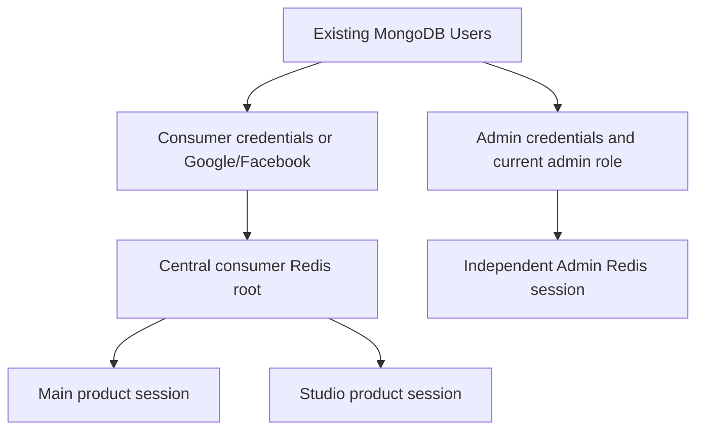

# Authentication boundary audit and implementation

## Audit findings

Before this change, Main, Studio and Admin used `createProductAuth` in
`packages/auth/src/server.ts`. Central Auth created a Redis root identity;
authorization-code exchange created child credentials referencing that root.
Each frontend stored its own credential inside an encrypted Auth.js cookie.
There are no independent refresh tokens: each session read obtains a new
five-minute API JWT after checking the Redis credential and current Mongo user.

`sessionCallbacks().events.signOut` always sent `scope: "all"` to
`SsoController.logout`. `SsoService.revoke` deleted the parent root when the
credential was a child. Consequently the sibling product failed its next
session/API validation. The cookies were already host-only; a shared parent
domain cookie was not causing this behavior. Main and Studio's dropdowns sent
users to `/login`, which immediately starts silent consumer SSO, obscuring logout.

Admin's `auth.ts`, login page and `/auth/start` used the same consumer flow.
`SSO_CLIENTS` registered Admin's callback, and the code exchange did not require
an admin role. A normal identity could therefore establish the Admin frontend
session; the protected layout rendered its shell before displaying denial.
The backend Admin guards subsequently rejected the user. API rejection alone
did not provide the requested frontend/session boundary.

The central `/authorize` route also decoded cookies with `AUTH_SECRET` directly
while central Auth.js preferred `BLYNTA_AUTH_SECRET`. These now use the same
`authSecret("blynta-identity")` selector.

## Resulting architecture



Normal product sign-out revokes only its child credential, clears its own
Auth.js cookie, and redirects to `/signed-out`. That public page offers an
explicit sign-in link. Later navigation to a protected route may silently
create a new product session through the still-valid central identity; this
is intentional. Local logout does not revoke other sessions in the same
product on separate devices.

The explicit global consumer action is the POST-backed sign-out form on central
Auth's `/logout` page, linked from product logout-complete pages. It removes the
central root, making all linked consumer credentials and previously issued API
tokens invalid. Other hosts' cookies remain until their next validation clears
them; they cannot authenticate while their root is missing. Admin is unaffected.

Admin always uses `createAdminAuth`, regardless of the consumer rollout flag.
Its only provider is credentials. `/auth/admin/login` authenticates against
existing Users, verifies the existing `admin` role, then creates an independent
eight-hour Redis session with `kind: admin`. No second collection is created.
`/auth/admin/session` checks expiry, revocation, active account and current role.
The Admin proxy checks the encrypted cookie's kind/role/expiry; its protected
server layout performs live backend validation before rendering the shell.

JWT strategy derives session kind from Redis, not client-supplied claims, and
reads current user role. All six Admin controllers retain both JWT and Admin
guards. AdminGuard now requires an independent Admin session as well as the
current admin role, so even an administrator's consumer JWT is insufficient.
Role removal rejects existing Admin cookies and previously issued API tokens
on their next validation. Password reset deliberately revokes all sessions for
that user, including Admin, as an account-security operation.

Only `blynta-main` and `blynta-studio` can use consumer authorization. Admin is
rejected even if an outdated registry still lists it. PKCE S256, random state,
exact registered callbacks, 60-second random codes, and atomic compare/delete
remain enforced. Admin's old `/auth/start` directs to its dedicated login;
`/auth/callback` rejects consumer handoffs.

## Cookie ownership

Names below omit the production `__Host-` prefix for custom cookies. All custom
cookies have no Domain attribute (host-only), Path `/`, HttpOnly, SameSite Lax,
and Secure in production. Cookies may be chunked by Auth.js when necessary.

| Cookie | Owner | Lifetime | Created / validated / removed by |
| --- | --- | --- | --- |
| `blynta-identity-session` | Auth | Auth.js rolling 7 days; Redis absolute 7 days | Central Auth.js / backend consumer session checks / central signOut |
| `blynta-blynta-main-session` | Main | Auth.js rolling 7 days, capped by root expiry | Code exchange and Auth.js / cookie plus backend / Main signOut |
| `blynta-blynta-studio-session` | Studio | Same as Main | Code exchange and Auth.js / cookie plus backend / Studio signOut |
| `blynta-admin-session` | Admin | Auth.js rolling 8 hours; Redis absolute 8 hours | Admin credentials / cookie plus live role/session checks / Admin signOut |
| `blynta-blynta-main-transaction` | Main | 10 minutes | `/auth/start` / authenticated JWE, client, state, expiry, callback and PKCE / successful callback or expiry |
| `blynta-blynta-studio-transaction` | Studio | 10 minutes | Same as Main |
| `blynta-authorization` | Auth | 10 minutes | `/authorize` pending public request / backend validates parameters before issuing code / successful authorization or expiry |

Auth.js auxiliary cookies are also host-only, Path `/`, HttpOnly, Lax, Secure
on HTTPS. Each host can create `authjs.callback-url` and `authjs.csrf-token`
(browser-session lifetime). HTTPS prefixes are `__Secure-` and `__Host-`
respectively. The central social flow additionally uses
`__Secure-authjs.pkce.code_verifier` and `__Secure-authjs.state` with 15-minute
limits; checks consume/clear them on callback. Non-HTTPS development names
omit prefixes. Google requires PKCE/state, Facebook state. No nonce or WebAuthn
provider is configured. Auxiliary cookies are not product session credentials.
On localhost cookies ignore ports, so auxiliary names can overlap; the HTTP
suite fetches a fresh host's CSRF token before each mutation.

Retired Studio legacy configuration may use `AUTH_COOKIE_DOMAIN`; it is inactive
when consumer central auth is enabled. The current consumer and Admin factories
do not use it. Admin's old `blynta-blynta-admin-session` cookie is ignored.

## Secrets and environment

`authSecret` selects `BLYNTA_APP_AUTH_SECRET`, `BLYNTA_STUDIO_AUTH_SECRET`,
`BLYNTA_ADMIN_AUTH_SECRET` or `BLYNTA_AUTH_SECRET` for the corresponding app,
then falls back to `AUTH_SECRET` / `NEXTAUTH_SECRET`. Use four distinct random
secrets. Auth.js encryption derives a key using the cookie name as salt, so an
identical base secret did not by itself make differently named cookies
interchangeable. Separate secrets additionally isolate a compromised service.
Never use the bridge or backend JWT secret as a frontend encryption secret.

The local audit found Admin's effective secret duplicated another frontend's.
A new independent `BLYNTA_ADMIN_AUTH_SECRET` was generated in its ignored
`.env.local`; no secret values were printed. Local setup now selects and preserves
the app-specific keys, and regenerates duplicates when configuring the apps.
This local change does not update Vercel: set an independent Admin secret there
and redeploy. Keep it stable across subsequent redeployments.

`SSO_BRIDGE_SECRET` is shared only by central Auth and the backend's trusted
consumer credential/social bridge. Admin credential validation needs no bridge
header; it verifies the password and role directly. Backend JWT_SECRET signs
API tokens, whose Redis session and Mongo role remain authoritative.

BACKEND_SERVICE_URL takes priority for server calls when the Vercel binding is
present; BACKEND_URL and public-backend fallbacks support separate deployments.
NEXT_PUBLIC_* values are browser API origins, never secret storage. AUTH_APP_URL
is the central consumer origin; MAIN_APP_URL/STUDIO_APP_URL bind exact consumer
callbacks. ADMIN_APP_URL identifies Admin, not an SSO callback. AUTH_URL must
match the application's origin for separate Vercel projects. Shared multi-service
deployments must not set a single common AUTH_URL; see vercel-services.md.

Set this registry on the **backend**, using your actual deployed origins:

```dotenv
SSO_CLIENTS={"blynta-main":["https://blynta.vercel.app/auth/callback"],"blynta-studio":["https://studio-blynta.vercel.app/auth/callback"]}
```

App and Studio require CENTRAL_AUTH_ENABLED=true. Admin no longer depends on
the flag; its examples use false. Example/commented production blocks and local
setup now omit Admin from the registry. Comments are documentation and do not
configure Vercel. The existing Vercel service bindings need no routing changes.
Deploy the backend and all four auth-consuming frontends together; check their
runtime environment values before deployment. Existing Google/Facebook callback
URLs remain on central Auth under `/api/auth/callback/google` and `/facebook`.
No Admin social callback needs registration.

## Migration

No MongoDB/user migration is required. Redis records without `kind` remain
consumer records, preserving existing App/Studio roots and child sessions.
The new Admin cookie name and backend session-kind requirement invalidate old
consumer-derived Admin access. Administrators must sign in again with their
existing password. Previously issued Admin consumer JWTs cannot pass AdminGuard.
Old cookies and Redis entries expire naturally. Account data and roles remain
unchanged; role promotion must use existing trusted administration tooling.

## Changed implementation areas

- packages/auth server factories, callbacks, token types and proxy policy.
- Backend SSO service/controller, new Admin authentication controller, JWT
  strategy, rate limits, Admin guards and their security tests.
- Admin auth entry, login, callback and protected layout; consumer dropdowns
  and public signed-out pages; central authorize decoder and global logout copy.
- HTTP integration fixture/suite, local setup, environment registries and Vercel
  environment documentation.

Concrete source paths changed for this boundary correction:

| Area | Files |
| --- | --- |
| Shared auth | `packages/auth/src/server.ts`, `proxy.ts`, `types.ts` |
| Backend sessions | `backend/src/auth/sso.service.ts`, `sso.controller.ts`, `admin-auth.controller.ts`, `jwt.strategy.ts`, `auth.module.ts`, `auth-rate-limit.guard.ts` |
| Backend authorization/tests | `backend/src/admin/guards/admin.guard.ts`, `admin.guard.spec.ts`, `backend/src/admin/admin-guards.spec.ts`, `backend/src/auth/admin-auth.controller.spec.ts`, `consumer-social.spec.ts`, `sso.service.spec.ts` |
| Admin | `apps/admin/auth.ts`, `app/(auth)/login/page.tsx`, `app/(main)/layout.tsx`, `app/auth/start/route.ts`, `app/auth/callback/route.ts`, `features/admin-auth/components/LoginForm.tsx` |
| Consumer logout | `apps/app/features/dashboard/components/UserDropdown.tsx`, `apps/studio/components/common/UserDropdown.tsx`, both products' `app/signed-out/page.tsx` |
| Central Auth | `apps/auth/auth.ts`, `app/authorize/route.ts`, `app/logout/page.tsx` |
| Integration/setup | `backend/test/sso-fixture.ts`, `scripts/test-sso.mjs`, `scripts/setup-local-auth.mjs` |
| Configuration/docs | Consumer registry references in frontend/backend `.env*` files, Admin local flag/secret override and `.env.example`, `README.md`, `docs/vercel-services.md`, this report and historical audit notices |

Existing unrelated working-tree changes were preserved. Secret-bearing environment
files remain ignored and must not be committed.

## Manual deployment checklist

Use two tabs per product and inspect cookie metadata without copying values.

1. Sign in at Main, then Studio: silent SSO, same existing user.
2. Sign in first at Studio, then Main: same result in the other direction.
3. Sign out of Main: public signed-out page stays visible; Studio and Admin stay
   authenticated in their tabs. Reopen protected Main: silent consumer re-entry.
4. Repeat local logout from Studio; Main and Admin remain authenticated.
5. With Main or Studio signed in as a normal user, open Admin root: dedicated
   email/password form, no consumer authorization redirect or Admin shell.
6. Submit normal-user credentials to Admin: rejected, no Admin session cookie.
7. Submit existing admin credentials: Admin dashboard and API access succeed.
8. Confirm Admin lists credentials only even when central Google/Facebook are
   enabled. Complete real Google and Facebook consent in central Auth and verify
   App/Studio identity handoff; real provider consent is not simulated by HTTP tests.
9. Sign out of Admin: all consumer tabs keep working.
10. Use central `/logout`: App/Studio sessions and API tokens fail on next check,
    while Admin continues. Existing tab pixels may remain until a session refresh,
    navigation or API call; server access is denied immediately.
11. Remove an admin role while signed in: refresh session/navigation and call an
    Admin API with its previously issued token; both reject access. Repeat with
    expired/revoked credentials and a malformed cookie.
12. Replay a callback/code, alter state/verifier/client/callback URI: reject
    without creating a session. Verify exact production HTTPS cookie flags.

Validation completed so far:

- 43 tests across six focused backend suites pass: consumer PKCE/code security,
  recovery, Admin session authorization and all six guarded Admin controllers,
  Google/Facebook linking to existing users and subsequent Main/Studio SSO.
- 13 identity transport tests pass, including runtime service binding selection.
- The expanded isolated HTTP suite passes with real Next/Auth.js/Nest code and
  synthetic persistence: both SSO directions, provider discovery, normal-user
  Admin rejection, valid Admin dashboard, role removal, all four logout cases,
  issued-token revocation, silent re-entry, malformed cookies, state/PKCE/replay,
  CSRF and recovery. Two HTTP tab clients share a cookie jar; actual client-side
  BroadcastChannel and stale rendered-tab behavior remain on the manual checklist.
- Shared auth and all four affected frontends pass TypeScript checks; backend
  type check and Nest production build pass. Modified Admin frontend and backend
  security code pass scoped ESLint checks.
- Production Next.js builds pass for Admin, Auth, Main and Studio. Prettier
  checks pass for all changed code; `git diff --check` reports no whitespace errors.

The HTTP harness uses Webpack for its isolated development servers because the
retained Studio Next version produced stale routes on Turbopack cache reuse.
This does not alter application development/build configuration. Real provider
consent, production Mongo/Redis, and Vercel deployments remain manual checks.
